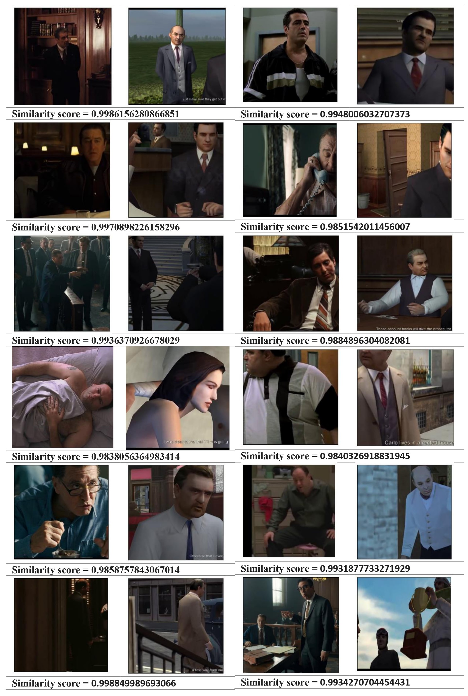
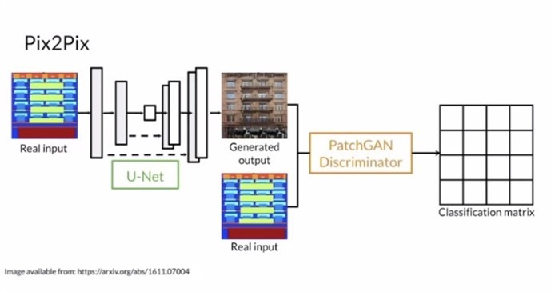
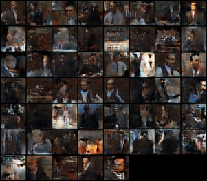
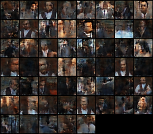

# Human Patch Extraction and Style Transfer
~~~
This work was performed using Python 3, hosted on Google Colab using the V100 GPU for processing.
~~~

## Human Patch Extraction
This is a semantic segmentation problem. We use the
pre-trained Mask-RCNN model “COCO” to detect
humans in the input frames. The dataset has 91 distinct
object classes; however, we only extracted objects
belonging to the “person” class. We iterate through
each video frame using cv2, only applying object
detection on every 24th frame (~every second), if a
person is detected with a confidence score above the
threshold value, then 4 frames spread across the
previous second are also run through the detector.
Doing this makes the patch extraction lightweight as we
don’t need all frames. We made the patches square to
ensure consistent sizes throughout the project. We
gathered 48,900 image patches in total.

## Patch Classification
We used the pytorch
keypointrcnn_resnet50_fpn model (mask-RCNN) to
estimate the joint positions / key points. The 4 classes
given are:
FULL-BODY-FRONT-VIEW
HEAD-AND-SHOULDER-FRONT-VIEW
FULL-BODY-BACK-VIEW
HEAD-AND-SHOULDER-BACK-VIEW
For each output tensor we used the person with the
highest score (as some images contain multiple people).
In some cases, this results in the wrong person being
used, we tested with taking the person with the largest
average size instead, but this didn’t work as well. There
are 17 output classes, and we use these to classify each
image based on the confidence of features. For
example, high confidence in facial features shows us
that it is a front view. This method worked very well for
classification and it’s an intuitive design.

## Pair Selection
To improve human style transfer training, we require
paired images. The proposed method of finding such
pairs is to do the cosine similarity between movie-game
estimated key point positions. 
This gives us images that contain
humans with similar poses, which is very useful and
ignores irrelevant background information that would
come from doing cosine similarity on the image arrays
directly. The algorithm was altered to save all
estimated feature positions. Pairs were then saved into
CSVs for reference in style transfer. Note that pairs also had
to belong to the same classification group. Overall,
this method performed incredibly well on pairing the
images.

## cycleGAN
In this work we used a cycleGAN as the unpaired
image-image network. The goal of the cycleGAN is to
learn a mapping between the movie and game domains.
We use two generators 𝐺1: 𝑀 → 𝐺, 𝐺2: 𝐺 → 𝑀 to create
the images and then two adversarial discriminators, DM
and DG. The discriminators attempt to distinguish
between the real and generated images.

Our implementation takes movie and game images as
inputs using a custom data loader. These images are
split into training and testing data and then transformed
using the albumentations library. For each image we
scale to 200x200 pixels, randomly flip, normalize and
then convert into a torch tensor. We use a smaller tensor
size in order to reduce training time. Our model can be
saved and loaded as necessary, so we ran it for as many
epochs as possible with a batch size of 32 images.
The model was trained for around 6 hours, and clearly it
requires more training. Our results with this method yield okay results and
features can be made, however the generator seems to
be outputting very low brightness images. This could be
because the provided videos are generally dark, but it
makes them difficult to analyse.

## conditionalGAN pix2pix 
We implemented a paired image-image
network ‘pix2pix’. It is a form of conditional GAN
based on U-net and a PatchGAN discriminator and
contains skip connections from encoder network
activations to decoder network output. 

For this task the paired images were scaled to
64x64 as I was strapped for time and wanted to train the
model quickly. This model is a big improvement over
the cycleGAN, it had a faster learning rate and overall
better results on the validation datasets.
Overall, we have observed that using paired images and
a conditional GAN yields much better results than just
using a cycleGAN. The well paired images really
helped with the detail in the images and accuracy of the
translations. Running this model for longer and
increasing the number of images we ran through the
cosine similarity function would help to improve these
further.

